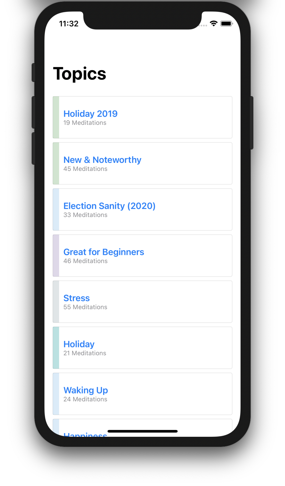
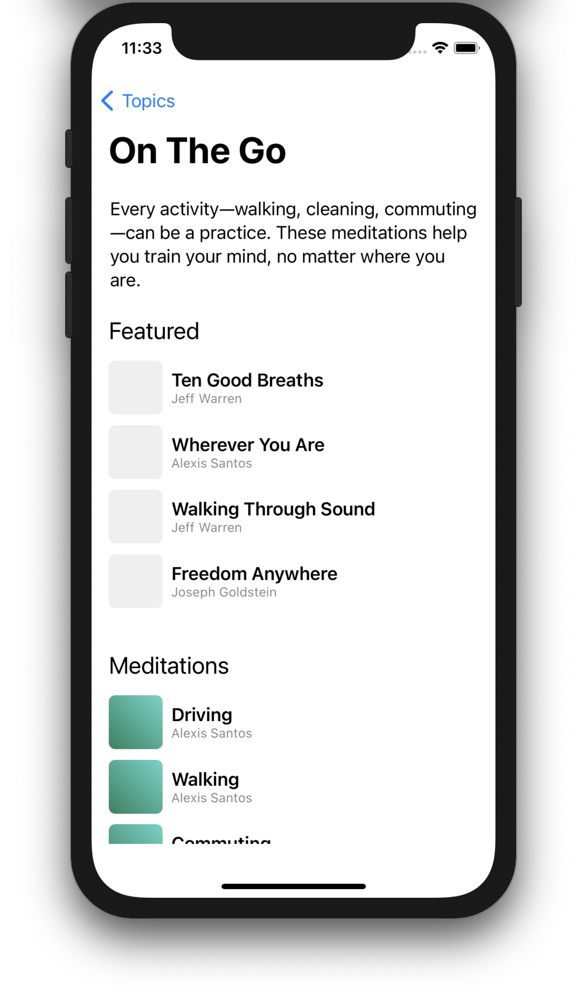

# Meditate

iOS app to browse meditations by topic.

"Meditation" was completed during an take-home interview assignment and it's purpose is to showcase my work implementing various features available in most iOS apps: networking, filtering data, displaying data, navigation.

I've cached the `json` and image files in the project in the case the network API is taken down or changed. To test against the network, set `useRemoteAPI` to `true` in `Meditate.app`.

### Features

* Browse a list of meditations by topics
* SwiftUI previews match mockups
* Unit tested

### Implementation Details

* Uses SwiftUI + MVVM for the UI layer
* Uses Combine for publishing and listening to changes
